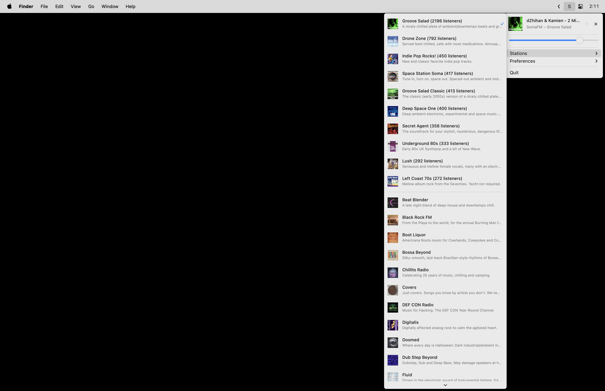

# SomaFM for macOS

Native macOS menu bar player for [SomaFM](https://somafm.com) internet radio. Listen to 30+ unique underground/alternative radio channels with just one click.

> [!NOTE]
> This is an unofficial third-party player. For official SomaFM apps, visit [somafm.com](https://somafm.com).



## Installation

### Direct Download

1. Download the latest version from [Releases](https://github.com/retlehs/somafm-macos-player/releases/latest)
2. Unzip and drag **SomaFM Menu Bar Player.app** to your Applications folder
3. Launch SomaFM from Applications (you may need to right-click and select "Open" the first time)

### Homebrew

Install with:

```bash
brew tap retlehs/tap
brew install --cask retlehs/tap/somafm-player
```

## Features

- 30+ SomaFM stations
- Top 10 stations by listener count, plus full alphabetical list
- Rich station menu with artwork and descriptions
- Live track updates every 10 seconds
- Media key support (Play/Pause)
- Independent in-app volume control
- Clickable track title to search the current song
- Auto-play on launch option
- Lightweight menu bar experience
- Native macOS app with dark mode support

## Support SomaFM

**SomaFM is listener-supported, commercial-free radio.** 

If you love these stations, please [donate to SomaFM](https://somafm.com/support/) to keep them on the air. They've been providing incredible underground radio since 2000, with no commercials, and they need your support!

> [!WARNING]
> This app is unofficial and not affiliated with SomaFM. For official apps, visit [somafm.com](https://somafm.com).
